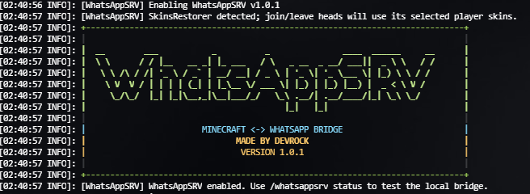

<h1 align="center">WhatsAppSRV</h1>

<p align="center"><strong>Bridge your Minecraft server and WhatsApp community with one JAR.</strong></p>

<p align="center">
  <a href="https://github.com/devrock07/WhatsAppSRV/actions/workflows/build.yml"></a>
  <a href="https://github.com/devrock07/WhatsAppSRV/releases/latest"></a>
  <a href="LICENSE"></a>
  
</p>

<p align="center">
  <a href="https://github.com/devrock07/WhatsAppSRV/releases/latest"><strong>Download latest</strong></a>
  · <a href="#quick-start">Quick start</a>
  · <a href="#commands-from-whatsapp">WhatsApp commands</a>
  · <a href="SECURITY.md">Security</a>
</p>

<p align="center">
  
</p>

<p align="center"><sub>The real v1.0.1 startup banner running on a Pterodactyl-hosted Minecraft server.</sub></p>

WhatsAppSRV relays chat and server events, renders real player skins and a graphical server-status card, and exposes a deliberately small set of safe WhatsApp commands. Its private Node.js + `whatsapp-web.js` bridge is installed and managed automatically, including on Linux x64 and ARM64 Pterodactyl hosts.

> [!WARNING]
> WhatsAppSRV uses the unofficial `whatsapp-web.js` client. It is not affiliated with or endorsed by WhatsApp or Meta. Automated accounts can be logged out, rate-limited, or restricted. Avoid spam and use a separate WhatsApp account you can afford to lose.

## At a glance

| | |
| --- | --- |
| **Install** | Upload one JAR; the private bridge and browser are prepared automatically. |
| **Minecraft** | Paper or Spigot 1.16.5 and newer. |
| **Hosting** | Linux x64 and ARM64, including restricted Pterodactyl containers. |
| **WhatsApp target** | Select one group or DM by its readable name. |
| **Session** | Linked-device login persists across normal server restarts. |
| **Created by** | [DevRock](https://github.com/devrock07). |

## Highlights

- One-JAR installation with an embedded, localhost-only bridge
- Automatic private Node.js runtime setup on Linux x64 and ARM64
- QR login in the server console and as `plugins/WhatsAppSRV/bridge/qr.png`
- Persistent linked-device session across normal server restarts
- Readable group and DM selection with `/wasrv chats` and `/wasrv select`
- Two-way Unicode chat relay, including normal WhatsApp emoji
- Join/leave cards with the player's real skin head and online count
- Optional SkinsRestorer integration, Bukkit profile fallback, then Steve/Alex fallback
- Death, advancement, startup, and shutdown notifications
- Safe WhatsApp commands with direct replies and progress/result reactions
- Graphical `/status` card with server icon, TPS, memory, uptime, version, players, and skin heads
- Admin-only `/whitelist add`, `/whitelist remove`, and `/whitelist list`
- Exact sender + exact full-command allowlists for any optional console commands
- Colored, fixed-width startup branding with built-in DevRock credits

## Requirements

- Paper or Spigot 1.16.5 or newer
- A Java version supported by your Minecraft server (Java 17 or newer is recommended)
- Linux x64 or ARM64 for automatic runtime installation
- Node.js 24 or newer only when supplying a custom `runtime.node-executable` (the automatic runtime is already compatible)
- At least 750 MB of free persistent storage (1 GB recommended) for Node.js, npm packages, Chromium, and session data
- Outbound HTTPS access to download the verified Node.js runtime and browser dependencies
- Permission to launch child processes inside the host container

The plugin bytecode targets Java 8 for broad API compatibility, but modern Paper versions require a newer Java runtime of their own.

## Quick start

1. Download `WhatsAppSRV-1.0.1.jar` from the [latest GitHub release](https://github.com/devrock07/WhatsAppSRV/releases/latest).
2. Upload it to the server's `plugins` directory.
3. Start the Minecraft server and allow the first-start installation to finish. Small hosts can take several minutes.
4. In WhatsApp, open **Linked devices → Link a device** and scan the QR shown in the Pterodactyl console. You can also download `plugins/WhatsAppSRV/bridge/qr.png` through the host file manager.
5. Wait for `WhatsApp client is ready` in the console.
6. Run `/wasrv chats` from the server console or as an operator.
7. Choose the numbered group or DM with `/wasrv select <number>`.
8. After the automatic bridge restart is ready, run `/wasrv test`.

Example:

```text
wasrv chats
wasrv select 2
wasrv status
wasrv test
```

The linked-device login is saved in `plugins/WhatsAppSRV/session`. A normal restart does not require another QR scan. Never publish, share, or commit that directory.

## Minecraft administration commands

All commands require `whatsappsrv.admin`, which defaults to server operators.

| Command | Description |
| --- | --- |
| `/wasrv status` | Show the embedded runtime, bridge readiness, and selected target. |
| `/wasrv chats` | List up to 50 WhatsApp groups and DMs by readable name. |
| `/wasrv select <number>` | Save an item from the latest chat list and restart the bridge. |
| `/wasrv senders` | Privately show recently observed sender IDs in the Minecraft console. |
| `/wasrv test` | Queue a test message to the selected WhatsApp chat. |
| `/wasrv reload` | Reload configuration and restart the embedded bridge. |
| `/wasrv credits`, `/wasrv about` | Show the colored WhatsAppSRV banner, version, and creator credit. |

`/wasrv senders` exists for configuration only. Sender IDs are never exposed by a WhatsApp command.

## Commands from WhatsApp

A message beginning with `/` in the selected chat is treated as a command and is not broadcast into Minecraft. WhatsAppSRV reacts with ⏳ while it works, then replies directly to that message and changes the reaction to ✅ or ❌.

| Command | Access | Result |
| --- | --- | --- |
| `/players`, `/list` | Read-only | Online count and player names. |
| `/status` | Read-only | Graphical server card with TPS, RAM, uptime, version, server icon, and online player heads. |
| `/tps` | Read-only | Paper's 1, 5, and 15 minute TPS values. |
| `/version` | Read-only | Full Minecraft server version. |
| `/ping` | Read-only | Bridge/server response check and player count. |
| `/about`, `/credits` | Read-only | WhatsAppSRV version, project link, and creator credit. |
| `/help` | Read-only | Available WhatsApp commands. |
| `/whitelist add <username>` | WhatsApp group admin | Add one validated Minecraft username to the whitelist. |
| `/whitelist remove <username>` | WhatsApp group admin | Remove one validated Minecraft username from the whitelist. |
| `/whitelist list` | WhatsApp group admin | List the current Minecraft whitelist. |

Whitelist usernames must match normal Minecraft account-name syntax. These dedicated commands never expose `whitelist on`, `whitelist off`, `reload`, or arbitrary arguments.

### Authorization model

The defaults are intentionally conservative:

1. Built-in status commands are read-only. An empty `whatsapp-commands.allowed-sender-ids` list allows members of the selected chat to use them; populate the list to restrict access.
2. Whitelist changes require the sender to be an administrator of the selected WhatsApp group. Explicit IDs in `whatsapp-commands.admin-sender-ids` can grant the same limited administrative access where group-admin metadata is unavailable, such as a selected DM. A populated general `allowed-sender-ids` list still applies first.
3. Arbitrary console execution is disabled. If enabled, the sender must pass the group-admin/explicit-admin gate, independently match `whatsapp-commands.console.allowed-sender-ids`, and send a command that exactly matches an entire entry in `whatsapp-commands.console.allowlist`.

There is no prefix or partial matching for console commands. Allowing `tps` does not allow `tps anything`, and allowing `whitelist list` does not allow `whitelist off`.

## Relayed events and media

Each relay can be enabled independently under `forward` and its text can be changed under `formats`.

- Minecraft chat → WhatsApp
- WhatsApp text and Unicode emoji → Minecraft
- Player joins and leaves
- Death messages
- Non-recipe advancements
- Server startup and shutdown

Vanilla Minecraft chat cannot embed a WhatsApp sticker, image, video, document, location, or voice note. WhatsAppSRV preserves those messages as readable labels such as `[Sticker]`, `[Image]`, and `[Voice message]`, including a text caption when available. Normal Unicode emoji is kept unchanged; its appearance in Minecraft depends on the client's font or resource pack.

## Player skins and status graphics

For join/leave images and the `/status` player grid, skin lookup follows this order:

1. The selected skin reported by SkinsRestorer, when the plugin is installed and exposes a compatible API.
2. The texture attached to the Bukkit player profile.
3. A deterministic Steve or Alex fallback.

SkinsRestorer is a soft dependency; WhatsAppSRV starts normally without it. Image downloads and rendering happen away from the server thread, and a text fallback is sent if image delivery fails.

The status card uses the server icon when one is available and falls back to a built-in visual when it is not. TPS is available on Paper-compatible servers; unsupported metrics are shown as unavailable rather than failing the command.

## Configuration

The generated configuration is `plugins/WhatsAppSRV/config.yml`. Important sections are:

| Key | Purpose |
| --- | --- |
| `target-chat-id` / `target-chat-name` | Selected WhatsApp destination; normally managed by `/wasrv select`. |
| `whatsapp-commands` | Command toggle, cooldown, reply limits, and sender access. |
| `whatsapp-commands.admin-sender-ids` | Optional explicit administrators for limited whitelist commands. |
| `whatsapp-commands.console` | Disabled-by-default exact console allowlists. |
| `player-heads` | Join/leave image toggles. |
| `forward` | Individual relay event toggles. |
| `formats` | Outbound and inbound message templates. |
| `incoming.max-message-codepoints` | Maximum WhatsApp text relayed into Minecraft. |
| `runtime` | Automatic startup, Node version, custom executable, and install timeout. |
| `console-banner.enabled` | Show the colored ASCII startup banner and DevRock credit. |

After editing configuration, run `/wasrv reload`. Do not hand-edit `bridge/config.json`; it is regenerated from the private plugin configuration.

### Safe console allowlist example

```yaml
whatsapp-commands:
  console:
    enabled: true
    allowed-sender-ids:
      - "919999999999@c.us"
    allowlist:
      - "say Maintenance begins in 5 minutes"
      - "tps"
```

Only add commands whose complete effect you understand. Avoid permission, plugin-management, file, account, and shutdown commands.

## Generated data and privacy

The local bridge listens only on `127.0.0.1` and requires a generated bearer token. The following files are credentials or generated runtime data and must never be uploaded to GitHub or shared:

- `plugins/WhatsAppSRV/config.yml` — contains the private API token
- `plugins/WhatsAppSRV/session/` — contains the linked WhatsApp session
- `plugins/WhatsAppSRV/bridge/config.json` — generated bridge token/configuration
- `plugins/WhatsAppSRV/bridge/qr.png` — a live login QR while pairing
- Runtime, browser-cache, browser-work, and `node_modules` directories

WhatsApp messages are briefly held in a bounded in-memory queue before Minecraft retrieves them from the localhost bridge. WhatsAppSRV does not require a public web port.

See [SECURITY.md](SECURITY.md) for reporting and hardening guidance.

## Troubleshooting

### `WhatsApp ready: false`

Authentication and readiness are separate. After scanning the QR, wait for `WhatsApp client is ready`, then run `/wasrv status`. If WhatsApp revoked the linked device, remove only the stale plugin session after backing it up, restart, and pair once more.

### A QR appears after every restart

Confirm that `plugins/WhatsAppSRV/session` is on persistent storage, writable by the container user, and not removed by a host cleanup job. Also check **Linked devices** in the phone app for an explicit logout.

### Chromium does not launch

Automatic Linux setup supports x64 and ARM64, including the special Chromium bundle required by many ARM64 Pterodactyl images. If the host blocks subprocesses, executable files, outbound downloads, or required kernel features, the plugin cannot bypass that container policy. Ask the provider to permit them or provide a compatible browser through `CHROME_PATH`.

### `ENOSPC` despite free disk space

Container `/tmp`, inode, or per-directory quotas can be smaller than the advertised server disk. WhatsAppSRV redirects browser work into persistent plugin storage, but the provider may still enforce another quota. Check the Pterodactyl allocation, inode usage, and temporary-storage limits.

### `/wasrv chats` fails immediately after login

Wait until the bridge reports ready. A successful `authenticated` event alone does not guarantee that WhatsApp Web has finished loading chats.

## Updating

1. Back up `plugins/WhatsAppSRV/config.yml` and `plugins/WhatsAppSRV/session`.
2. Stop the server.
3. Replace the old JAR; do not run two WhatsAppSRV JARs together.
4. Start the server and review newly documented configuration options.
5. Run `/wasrv status` and `/wasrv test`.

Do not copy a linked-device session between two simultaneously running servers. WhatsApp may invalidate it.

## Building from source

Java 17 and Maven are recommended for building. The produced bytecode remains Java 8 compatible.

```bash
mvn -B clean verify
node --check bridge/index.js
```

The shaded plugin is written to `target/WhatsAppSRV.jar`. The bridge source and pinned npm lockfile are embedded in that JAR; `bridge/node_modules` is not.

See [CONTRIBUTING.md](CONTRIBUTING.md) before submitting a change.

## Project status

WhatsApp Web changes without notice, so occasional compatibility updates are expected. Report reproducible bugs through GitHub Issues, but send security reports privately as described in [SECURITY.md](SECURITY.md).

## Credits

Created by [DevRock](https://github.com/devrock07). Run `/wasrv credits` at any time to show the in-console credit banner.

## License

WhatsAppSRV is available under the [MIT License](LICENSE). Third-party components retain their own licenses; see [THIRD_PARTY_NOTICES.md](THIRD_PARTY_NOTICES.md).
